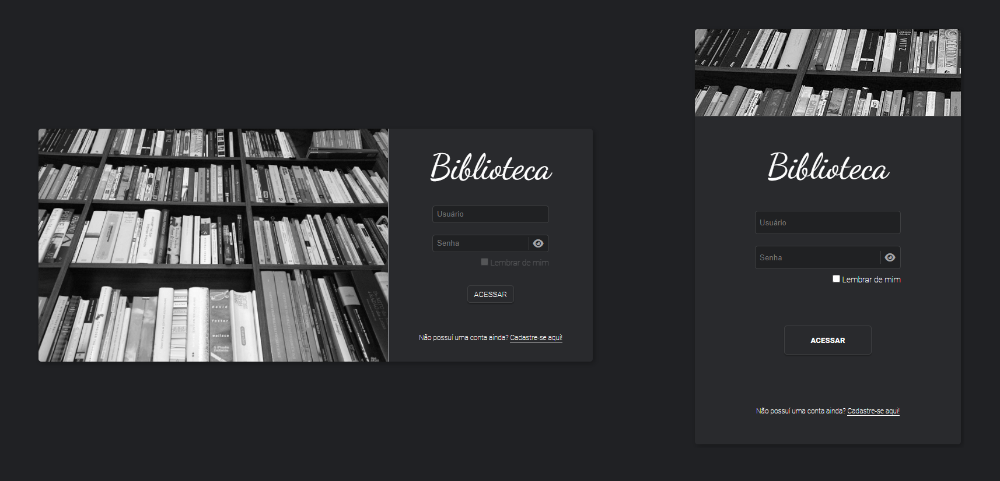

# Biblioteca

> Uma plataforma de biblioteca e leitura online, uma rede social para amantes da literatura & e-read 🥰

#

### Desenvolvimento

O projeto está ainda em fase de desenvolvimento, e estou caminhando para desenvolver as seguintes features:

- [x] Páginas responsivas c/ SASS
- [ ] Biblioteca de Componentes c/ SASS (CSS)
- [ ] CRUD (Users, E-Books, Revistas, etc)
- [ ] Interface Intuitiva para os usuários
- [ ] API para comunicação da plataforma

#

## 💻 Tecnologias utilizdas até o momento:

 

    
    
    
    

Você pode conferir como o projeto está atravês <a href="https://biblioteca-online.netlify.app/"> deste link!</a>

#

## 😄 Obrigado pela presença 

Muito obrigado por reservar um pouco do seu precioso tempo averiguando este projeto, pra você pode não ser muito, mas para mim é um enomre passo na minha carreira ❤

[⬆ Voltar ao topo](#nome-do-projeto) 
